# Architecture — Gmail MCP Server

## Overview

A [Model Context Protocol (MCP)](https://modelcontextprotocol.io) server that exposes 17 Gmail tools to any MCP-compatible AI client (Claude Desktop, VS Code Copilot, etc.). All communication with the client uses **stdio** (stdin/stdout JSON-RPC). No HTTP port is exposed by the MCP server itself.

The server has three independently-enabled capability layers:

| Layer | Always on? | What it does |
|---|---|---|
| Core Gmail tools | Yes | Read, search, send, manage emails and labels |
| Attachment safety | Yes | Policy-gated download with magic-byte MIME verification |
| Local privacy pipeline | Optional (`--profile privacy`) | PII redaction via deterministic regex + local vLLM |

---

## High-Level Architecture

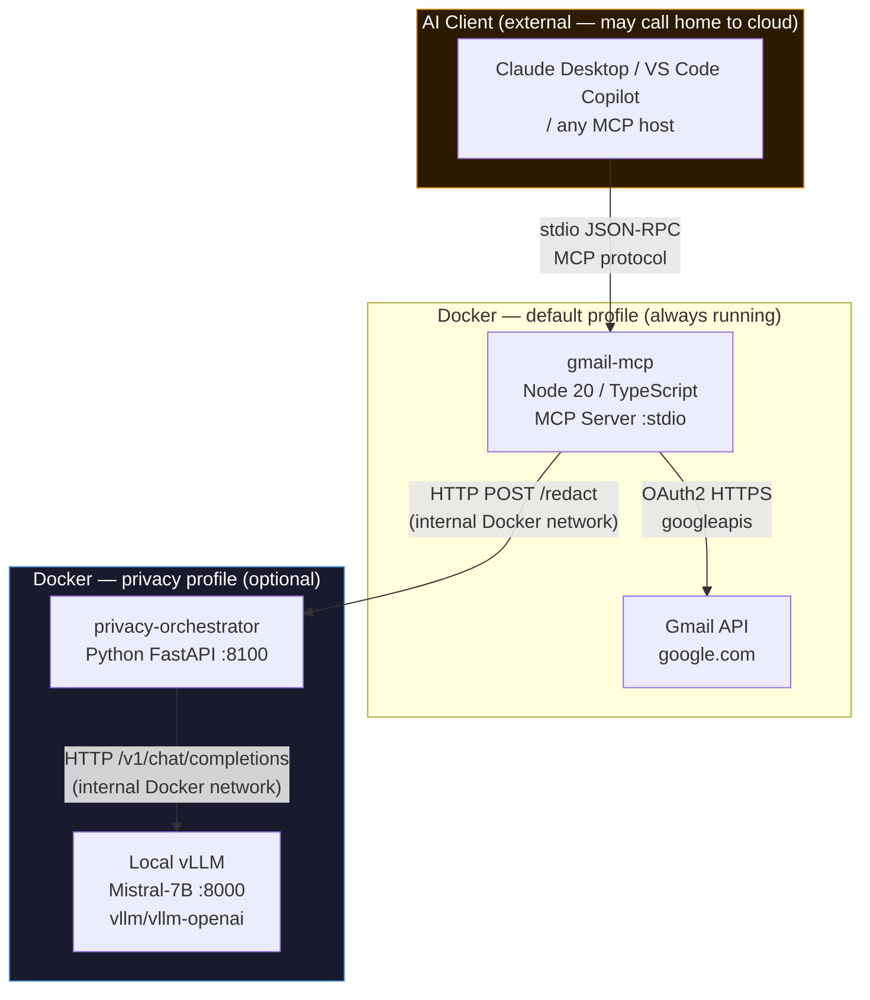

**Critical boundary:** the MCP server is the only process that ever touches raw Gmail data. The external AI client receives only what the MCP server decides to return — redacted or raw, depending on which tool is called.

---

## The Core Privacy Question: Who Sees What?

> **"When an external AI calls the MCP server, will the MCP server use vLLM to filter out privacy information?"**

**Yes — but only when the AI chooses the `read_email_with_privacy` tool.** The server exposes two parallel paths for reading email content:

| Path | Tool called | vLLM involved? | What external AI receives |
|---|---|---|---|
| **Raw** | `read_email` | No | Full unredacted email text, including all PII |
| **Privacy** | `read_email_with_privacy` | Yes (if `--profile privacy` running) | Redacted text only — PII replaced with `█` blocks |

The external AI model (Claude, GPT-4, etc.) **cannot see inside the MCP server**. It only sees the JSON the server returns. If it uses the privacy tool, the local vLLM has already filtered the text before the response leaves the server process.

---

## Sequence A — Raw Email Path (`read_email`)

No local vLLM is involved. The external AI receives the email with all PII visible.

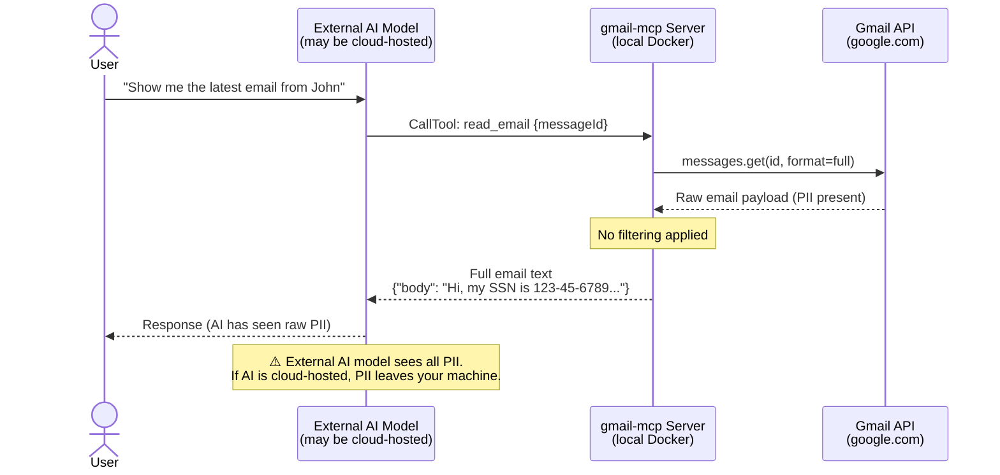

---

## Sequence B — Privacy-Filtered Path (`read_email_with_privacy`)

The local vLLM acts as a PII firewall. The external AI only ever sees redacted output.

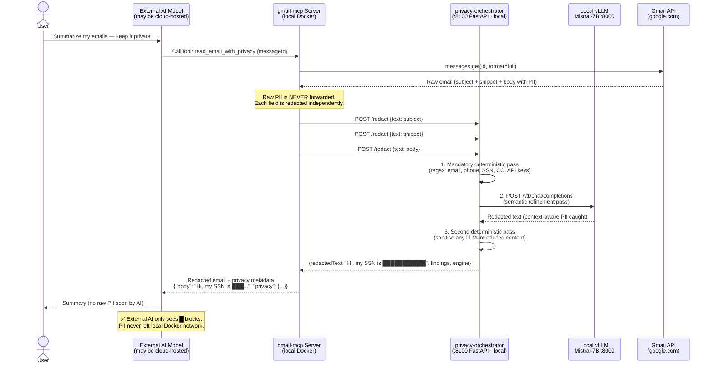

---

## Sequence C — Fallback Path (privacy profile NOT running)

When the privacy services are stopped, `enableLocalFallback=true` means the Node process itself runs the regex patterns rather than throwing an error.

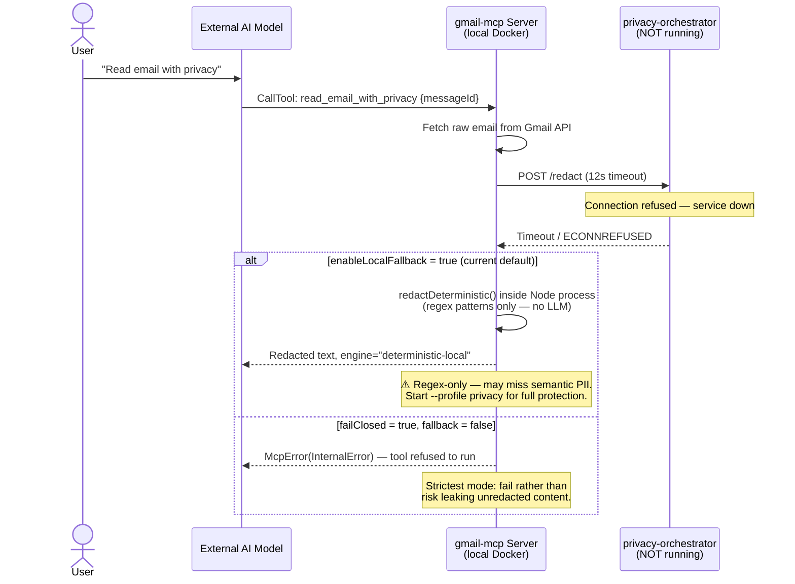

---

## The Re-identification Problem: "How Do I Get PII Back?"

This is the central design tension in any privacy redaction system:

> **"If the external AI only sees redacted text, how can it perform actions that require the real data — like replying to an email or looking up a contact?"**

### Current approach: two parallel tool sets

The server currently solves this by giving the AI **two separate tools** for each use case. The AI (or the user instructing the AI) decides the trust level per task:

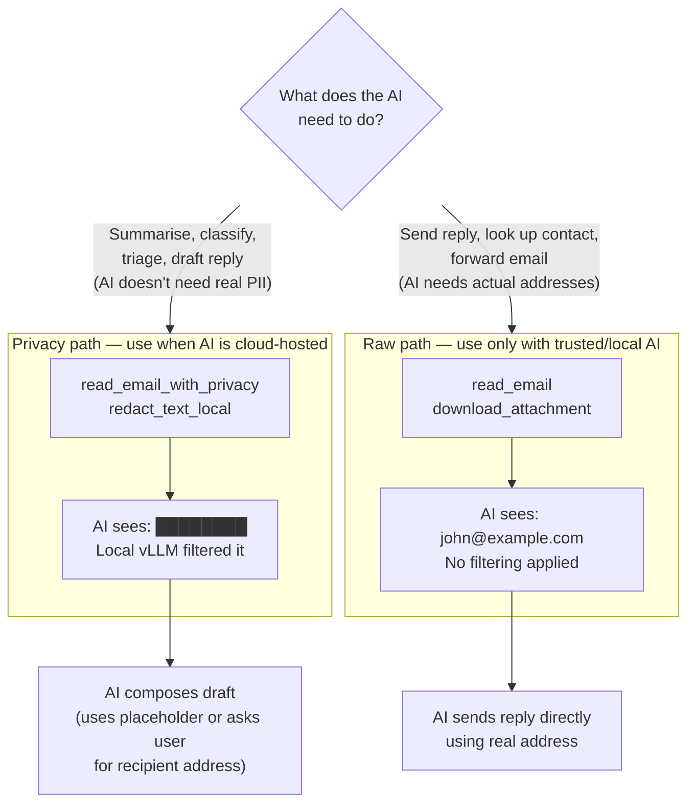

### The gap: token-based re-identification (currently using opaque blocks as interim approach)

**Current limitation:** The privacy tools currently return **opaque `█` blocks**, which provide zero context to the external AI. This makes it impossible for the AI to:
- Understand **what type** of information was hidden (email? phone? SSN?)
- Perform **actions** that reference the hidden data (e.g., "reply to [hidden recipient]")
- Provide **context-aware workflows** (e.g., draft vs. send decisions)

**Better approach — tokens (planned for next phase):** Replace opaque masks with **meaningful tokens**:

```
Raw:      "Call John at john.smith@acme.com or 555-867-5309"
Current:  "Call John at █████████████████████ or ███████████"  ← AI sees NO context
Better:   "Call John at [EMAIL:e3f9a] or [PHONE:c7b21]"       ← AI has context + can act
```

The MCP server holds a **session token map** (`e3f9a → john.smith@acme.com`). When the AI produces output that contains a token (`send_email to: [EMAIL:e3f9a]`), the server resolves the token to the real value before calling the Gmail API — the AI never saw the actual address.

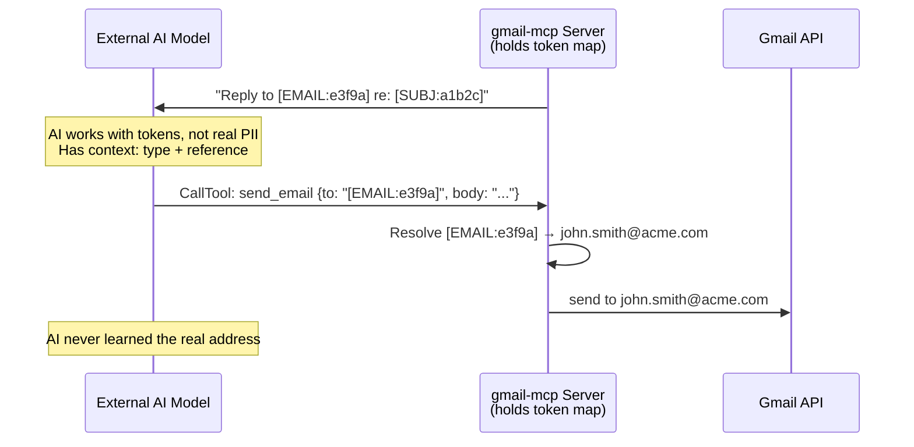

> **Status:** Token-based re-identification is **HIGH PRIORITY** for next integration phase (Step 1 in wiring checklist). The current opaque `█` implementation is interim and should be replaced. Privacy tools are currently suited for read/summarise workflows only; write/action workflows require the raw tools or token-based masking.

---

## MCP Tool Dispatch Flow

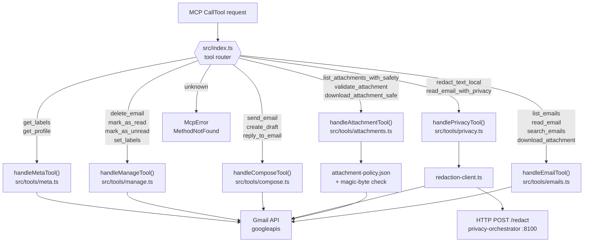

---

## Privacy Pipeline — Internal Detail

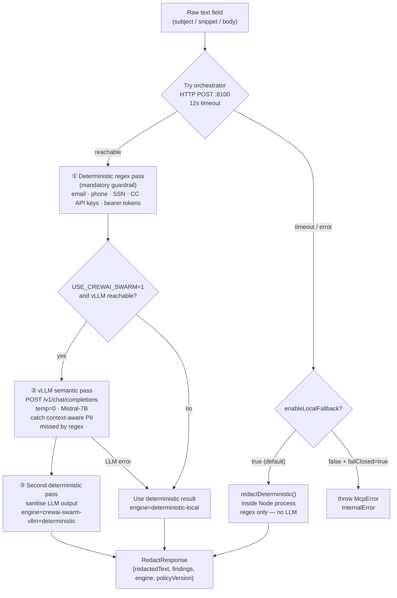

### Pattern coverage

| Pattern | Example input | Current output (interim) | Token-based output (planned) |
|---|---|---|---|
| `email` | `john.doe@company.com` | `█████████████████████` | `[EMAIL:a7f2k]` |
| `phone` | `+1 (555) 867-5309` | `███████████████` | `[PHONE:c7b21]` |
| `ssn` | `123-45-6789` | `███████████` | `[SSN:f9d2k]` |
| `credit_card` | `4111 1111 1111 1111` | `███████████████████` | `[CC:e5m3x]` |
| `api_key_like` | `sk-abc123proj...` | `███████████████` | `[APIKEY:b2w8n]` |
| `bearer_token` | `eyJhbGci...` (JWT) | `███████...` | `[TOKEN:k4r1p]` |

**Current approach (interim):** Each match → `█` × `max(3, len(match))`. The vLLM pass catches things like *"my social is three two one, forty five, six seven eight nine"* which regex cannot.

**Token approach (planned):** Each match → `[TYPE:hashsuffix]` where `hashsuffix` is deterministic 5-char hash of the PII value. Redis stores `hashsuffix → {value, type, messageId, TTL}`. AI can use tokens in tool calls; MCP resolves before Gmail API call.

---

## Directory Structure

```
/
├── src/
│   ├── index.ts                  # MCP server entry point & tool router
│   ├── gmail/
│   │   ├── auth.ts               # OAuth2 credential loading (env vars > files)
│   │   └── client.ts             # Singleton Gmail API client
│   ├── tools/
│   │   ├── emails.ts             # Core email tools (4)
│   │   ├── attachments.ts        # Attachment safety tools (3)
│   │   ├── privacy.ts            # Privacy-redacted email tools (2)
│   │   ├── compose.ts            # Send / draft tools (3)
│   │   ├── manage.ts             # Label / delete tools (4)
│   │   └── meta.ts               # Account info tools (2)
│   ├── privacy/
│   │   ├── redaction-client.ts   # Orchestrator call + deterministic fallback + token masking
│   │   ├── token-store.ts        # Redis-backed PII token mappings (NEW)
│   │   └── audit-db.ts           # SQLite compliance audit trail (NEW)
│   └── config/
│       ├── attachment-policy.json
│       └── privacy-policy.json
├── privacy-orchestrator/
│   ├── Dockerfile
│   ├── requirements.txt
│   └── app/
│       └── main.py               # FastAPI + deterministic + vLLM bridge
├── public/setup/index.html       # OAuth setup web wizard UI
├── scripts/load_env_vars.py
├── docker-compose.yml            # Runtime services
├── docker-compose.setup.yml      # One-time OAuth setup wizard
├── Dockerfile                    # Multi-stage Node build
├── package.json
└── tsconfig.json
```

---

## Authentication (`src/gmail/`)

### Credential loading priority (`auth.ts`)

1. **Environment variables** — `GMAIL_CLIENT_ID`, `GMAIL_CLIENT_SECRET`, `GMAIL_REFRESH_TOKEN`, `GMAIL_REDIRECT_URI`. Preferred for Docker deployments.
2. **`credentials/credentials.json`** — Google OAuth client credentials file (supports both `installed` and `web` key shapes).
3. **`credentials/token.json`** — Persisted OAuth token written by the setup wizard.

A single `OAuth2Client` is built and the refresh token is set directly when available, bypassing the need for the callback flow.

### Gmail client (`client.ts`)

A **module-level singleton** (`gmailInstance`) is created lazily on first use. Call `resetGmailClient()` to clear it after credential changes (used by the setup wizard CLI).

---

## Tool Reference

### Email tools (`src/tools/emails.ts`)

| Tool | Description |
|---|---|
| `list_emails` | List inbox (or filtered) emails — returns sender, subject, date, snippet |
| `read_email` | Full email read — decoded body, headers, attachment metadata |
| `search_emails` | Gmail query syntax search |
| `download_attachment` | Raw base64 download (no policy checks) |

### Attachment safety tools (`src/tools/attachments.ts`)

These tools apply the rules in `src/config/attachment-policy.json` before any bytes are returned.

| Tool | Description |
|---|---|
| `list_attachments_with_safety` | List attachments with per-file policy assessment |
| `validate_attachment` | Validate one attachment against policy (no download) |
| `download_attachment_safe` | Policy-gated download — blocks risky files |

**Validation checks (in order):**
1. Filename non-empty and within `maxFilenameLength` (180)
2. File size ≤ `maxSizeMB` (25 MB)
3. Extension not in `blockedExtensions`
4. MIME type in `allowedMimeTypes`
5. Magic-byte verification against declared MIME type

**Attachment policy (`src/config/attachment-policy.json`):**

```json
{
  "maxSizeMB": 25,
  "maxFilenameLength": 180,
  "allowedMimeTypes": ["application/pdf", "image/jpeg", "image/png", "image/gif", "text/plain"],
  "blockedExtensions": [".exe", ".dll", ".bat", ".cmd", ".ps1", ".sh", ".js", ".vbs", ".msi", ".jar"],
  "downloadTimeoutMs": 15000
}
```

### Privacy tools (`src/tools/privacy.ts`)

| Tool | Description |
|---|---|
| `redact_text_local` | Redact arbitrary text through the local privacy pipeline |
| `read_email_with_privacy` | Read email and return only redacted subject/snippet/body |

`read_email_with_privacy` makes three separate `redactWithPolicy()` calls (subject, snippet, body) and returns a `privacy` metadata block with per-field findings and engine names.

### Compose tools (`src/tools/compose.ts`)

| Tool | Description |
|---|---|
| `send_email` | Send email (plain text or HTML, optional attachments) |
| `create_draft` | Save a draft without sending |
| `reply_to_email` | Thread-aware reply |

### Manage tools (`src/tools/manage.ts`)

| Tool | Description |
|---|---|
| `delete_email` | Move to Trash (or `permanent: true` for hard delete) |
| `mark_as_read` | Remove UNREAD label |
| `mark_as_unread` | Add UNREAD label |
| `set_labels` | Add / remove arbitrary label IDs |

### Meta tools (`src/tools/meta.ts`)

| Tool | Description |
|---|---|
| `get_labels` | All Gmail labels with IDs and message counts |
| `get_profile` | Authenticated account email address and totals |

---

## Docker Services

### `gmail-mcp` (always on)

```yaml
build: . (Dockerfile, target: runtime)
image: gmail-mcp-server:latest
stdin_open: true   # stdio MCP transport requires open stdin
environment:
  GMAIL_CLIENT_ID, GMAIL_CLIENT_SECRET, GMAIL_REFRESH_TOKEN,
  GMAIL_REDIRECT_URI, PRIVACY_ORCHESTRATOR_URL
volumes:
  ./credentials → /app/credentials   # fallback for file-based auth
```

**Dockerfile** — two-stage build:
- `builder`: `node:20-slim`, installs all deps, runs `tsc`
- `runtime`: `node:20-slim`, production deps only, copies `dist/` and `public/`

### `vllm` (profile: privacy)

```yaml
image: vllm/vllm-openai:latest
port: 8000
command: --model mistralai/Mistral-7B-Instruct-v0.2 --host 0.0.0.0 --port 8000
```

Override the model with `VLLM_MODEL` env var. Requires NVIDIA GPU on Windows via Docker Desktop ≥ 4.29 (WSL2 + GPU-PV).

### `privacy-orchestrator` (profile: privacy)

```yaml
build: ./privacy-orchestrator
port: 8100
depends_on: [vllm]
environment:
  PORT, VLLM_BASE_URL, VLLM_MODEL, USE_CREWAI_SWARM
```

### Setup wizard (`docker-compose.setup.yml`)

Separate compose file used once to obtain OAuth tokens via browser. Starts a web server on port 3000 serving `public/setup/index.html`. Not part of the runtime stack.

### Docker network topology

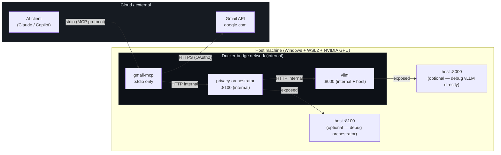

The MCP server has **no exposed host ports** — it communicates with the AI client purely over stdio. The privacy orchestrator and vLLM expose ports only for debugging; normal operation uses the internal Docker bridge.

---

## Startup Commands

| Scenario | Command |
|---|---|
| Core MCP server only | `docker compose up` |
| With local privacy pipeline | `docker compose --profile privacy up --build` |
| One-time OAuth setup | `docker compose -f docker-compose.setup.yml up` |
| Local dev (no Docker) | `npm run build && node dist/index.js` |

---

## Persistent Data Layer (Optional)

The server can be configured with two optional stores for production deployments:

### Redis Token Store (`src/privacy/token-store.ts`)

**Purpose:** Manage PII token mappings for session-aware re-identification.

When the future token-based re-identification feature is enabled, emails read with privacy tools return tokens like `[EMAIL:e3f9a]` instead of actual PII. This store holds the mapping:

```
e3f9a → john@acme.com (TTL: 1 hour)
```

When the external AI calls `send_email to: "[EMAIL:e3f9a]"`, the MCP server resolves the token before calling Gmail API — the AI never learned the real address.

**Configuration:**

```bash
export REDIS_URL=redis://redis:6379
docker compose --profile privacy up --build
```

**Database design:**

| Key | Value | TTL |
|---|---|---|
| `token:e3f9a` | `{value: "john@acme.com", type: "email", messageId: "msg_123", createdAt: 1711858800}` | 3600s (1h) |

**Behavior without Redis:**
- Token store disabled (no error)
- Privacy pipeline still works using opaque `█` blocks
- Re-identification feature cannot be used

### SQLite Audit Log (`src/privacy/audit-db.ts`)

**Purpose:** Compliance-grade audit trail of all PII detections and redactions.

Records each redaction event with:

```sql
INSERT INTO redaction_audit (
  timestamp, messageId, field, piiType, count, engine, fromAddress, subject
) VALUES (
  '2026-03-30T14:23:45Z', 'msg_abc123', 'body', 'email', 3, 
  'crewai-swarm-vllm+deterministic', 'alice@company.com', 'Q1 Reports'
)
```

**Stored at:** `/app/audit.db` (inside container; mount as volume for persistence)

**Example query — get all emails with detected SSNs:**

```sql
SELECT DISTINCT messageId, subject, fromAddress
FROM redaction_audit
WHERE piiType = 'ssn'
ORDER BY timestamp DESC;
```

**Exported operations:**

| Function | Purpose |
|---|---|
| `logRedactionEvent(record)` | Record a detected PII finding |
| `getAuditByMessageId(messageId)` | Retrieve all PII found in one email |
| `getPiiStatistics()` | Aggregate: how many emails, phones, SSNs, etc. found overall |
| `exportAuditLog(from, to)` | Export as JSON for legal hold or compliance |

**Example audit export:**

```json
[
  {
    "timestamp": "2026-03-30T14:23:45Z",
    "messageId": "msg_abc123",
    "field": "body",
    "piiType": "email",
    "count": 3,
    "engine": "crewai-swarm-vllm+deterministic",
    "fromAddress": "alice@company.com",
    "subject": "Q1 Reports"
  }
]
```

### Docker Compose Integration

Both services are in the `privacy` profile:

```bash
# Start with Redis + audit log enabled
docker compose --profile privacy up --build
```

**docker-compose.yml structure:**

```yaml
services:
  gmail-mcp:
    # existing config now receives REDIS_URL when redis service is running
    environment:
      - REDIS_URL=redis://redis:6379

  redis:
    profiles: ["privacy"]
    image: redis:7-alpine
    volumes:
      - redis_data:/data
    command: redis-server --appendonly yes

  # privacy-orchestrator, vllm also under privacy profile

volumes:
  redis_data:  # persisted across container restarts
```

### Use Cases

| Use case | Redis | Audit Log | When needed |
|---|---|---|---|
| Read/summarise with privacy | Optional | Optional | Basic redaction works without either |
| Session-aware token re-identification | **Required** | Optional | Planned feature: AI uses `[EMAIL:token]` placeholders that survive restarts |
| Compliance audit trail | Optional | **Required** | Legal hold, incident investigation, GDPR data requests |
| Multi-user setup | **Required** | Optional | Future: track which user's email was read when |

---

---

## Integration & Initialization (Critical for Production Use)

### Database Layer Integration Status

The Redis token store and SQLite audit log are **implemented but NOT YET WIRED** into the MCP server startup. The following checklist tracks integration work:

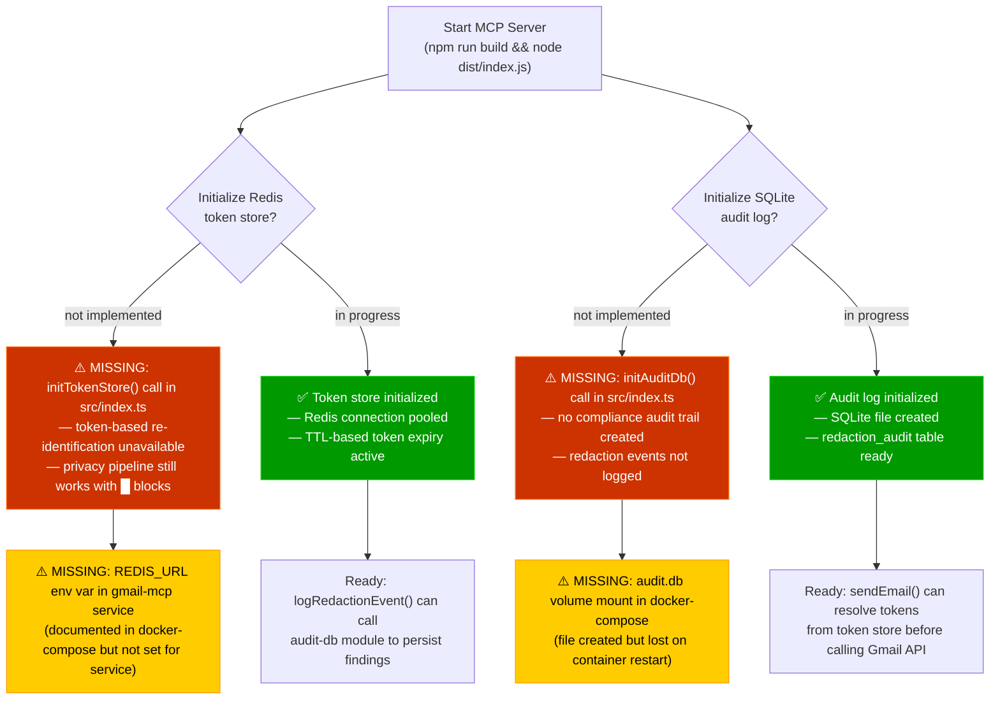

### Wiring Checklist

| Step | Component | Status | Priority | Details |
|---|---|---|---|---|
| 1 | **Implement token-based masking** | ⚠️ PENDING | 🔴 HIGH | Replace opaque `█` blocks with meaningful tokens: `[EMAIL:e3f9a]`, `[PHONE:c7b21]`, `[SSN:f9d2k]`. Gives AI context + enables token resolution in tool calls. Update `redaction-client.ts` to call `storeToken()` on each match, then return tokenized text. |
| 2 | **Wire token resolution in send_email** | ⚠️ PENDING | 🔴 HIGH | When AI calls `send_email to: "[EMAIL:e3f9a]"`, resolve token in MCP before calling Gmail API. Implement in `src/tools/compose.ts` by calling `resolveToken()` from token-store. |
| 3 | **Initialize token store** | ⚠️ PENDING | 🟡 MEDIUM | Add `initTokenStore()` call in `src/index.ts` main() function after server starts; gracefully handle Redis unavailable. |
| 4 | **Initialize audit log** | ⚠️ PENDING | 🟡 MEDIUM | Add `initAuditDb()` call in `src/index.ts` main() function after server starts; create audit.db file. |
| 5 | **Set REDIS_URL env var** | ⚠️ PENDING | 🟡 MEDIUM | Update gmail-mcp service in docker-compose.yml to include `REDIS_URL=redis://redis:6379` |
| 6 | **Create audit.db volume** | ⚠️ PENDING | 🟡 MEDIUM | Add volume mount `./audit:/app/audit` to gmail-mcp service in docker-compose to persist audit trail. |
| 7 | **Log redaction events** | ⚠️ PENDING | 🟡 MEDIUM | Add `logRedactionEvent()` calls in `src/privacy/redaction-client.ts` after redaction completes; skip if audit unavailable. |
| 8 | **Docker Compose validation** | ✅ DONE | — | Redis service added under privacy profile with volumes and default config |
| 9 | **TypeScript compilation** | ✅ DONE | — | Both token-store.ts and audit-db.ts compile clean with zero errors |
| 10 | **Package.json dependencies** | ✅ DONE | — | `redis@4.6.14`, `better-sqlite3@11.1.2`, `@types/better-sqlite3@7.6.8` installed |

### Startup Sequence (Desired State After Integration)

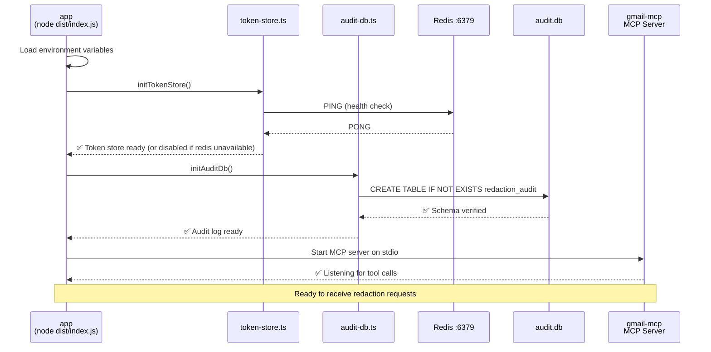

#### Step 0: Implement token-based masking (PRIORITY 1)

Replace opaque `█` blocks with meaningful tokens in `src/privacy/redaction-client.ts`:

```typescript
import { storeToken } from './token-store.js';

// Current interim approach (remove after token feature ready):
function maskMatch(match: string): string {
  return '█'.repeat(Math.max(3, match.length));
}

// Replace with token-based approach:
async function maskMatchWithToken(
  match: string,
  type: 'email' | 'phone' | 'ssn' | 'cc' | 'apikey' | 'token',
  messageId?: string
): Promise<string> {
  try {
    const tokenId = await storeToken(match, type, messageId);
    return `[${type.toUpperCase()}:${tokenId}]`;
  } catch (err) {
    // Fallback to opaque blocks if token store unavailable
    console.error(`Token store error, falling back to █: ${err}`);
    return '█'.repeat(Math.max(3, match.length));
  }
}

// In redactDeterministic() and LLM redaction loops:
// OLD: result = text.replace(emailRegex, () => maskMatch('email'));
// NEW: result = text.replace(emailRegex, (match) => maskMatchWithToken(match, 'email', messageId));
```

**Benefits:**
- ✅ AI sees `[EMAIL:a7f2k]` instead of `████████` — has context
- ✅ AI can call tools with tokens: `send_email to: "[EMAIL:a7f2k]"`
- ✅ MCP resolves tokens before calling Gmail API
- ✅ AI never learns the real address
- ✅ Graceful fallback to `█` blocks if Redis unavailable

---

#### Step 1: Initialize in src/index.ts

Add to the `main()` function **after** server.connect():

```typescript
import { initTokenStore } from './privacy/token-store.js';
import { initAuditDb } from './privacy/audit-db.js';

async function main() {
  const transport = new StdioServerTransport();
  await server.connect(transport);
  process.stderr.write('Gmail MCP Server running on stdio\n');

  // Initialize optional persistent stores
  try {
    await initTokenStore();
    process.stderr.write('✅ Token store initialized\n');
  } catch (err) {
    process.stderr.write(`⚠️ Token store skipped: ${err instanceof Error ? err.message : String(err)}\n`);
  }

  try {
    await initAuditDb();
    process.stderr.write('✅ Audit log initialized\n');
  } catch (err) {
    process.stderr.write(`⚠️ Audit log skipped: ${err instanceof Error ? err.message : String(err)}\n`);
  }
}
```

#### Step 2: Update docker-compose.yml gmail-mcp service

Add `REDIS_URL` to the environment block:

```yaml
services:
  gmail-mcp:
    # ... existing config ...
    environment:
      - GMAIL_CLIENT_ID=${GMAIL_CLIENT_ID:-}
      - GMAIL_CLIENT_SECRET=${GMAIL_CLIENT_SECRET:-}
      - GMAIL_REFRESH_TOKEN=${GMAIL_REFRESH_TOKEN:-}
      - GMAIL_REDIRECT_URI=${GMAIL_REDIRECT_URI:-http://localhost:3000/oauth/callback}
      - PRIVACY_ORCHESTRATOR_URL=${PRIVACY_ORCHESTRATOR_URL:-http://privacy-orchestrator:8100/redact}
      - REDIS_URL=redis://redis:6379   # ← ADD THIS LINE
    volumes:
      - ./credentials:/app/credentials
      - ./audit:/app/audit              # ← ADD THIS LINE
```

#### Step 3: Log redaction events in redaction-client.ts

After redaction completes, import and call the audit log:

```typescript
import { logRedactionEvent } from './audit-db.js';

async function redactWithPolicy(text: string, messageId?: string): Promise<RedactResponse> {
  // ... existing redaction logic ...

  const redacted = await redactInternal(text);

  // Log the findings if audit is available
  if (redacted.findings && redacted.findings.length > 0 && messageId) {
    try {
      for (const finding of redacted.findings) {
        await logRedactionEvent({
          timestamp: new Date().toISOString(),
          messageId,
          field: 'body', // or extract from context
          piiType: finding.type,
          count: finding.matches?.length || 1,
          engine: redacted.engine,
          fromAddress: 'N/A', // extract from Gmail message if available
          subject: 'N/A',
        });
      }
    } catch (auditErr) {
      process.stderr.write(`Audit log error: ${auditErr instanceof Error ? auditErr.message : String(auditErr)}\n`);
    }
  }

  return redacted;
}
```

### Production Deployment Checklist

- [ ] Redis service running under `--profile privacy` flag
- [ ] SQLite volume mounted to persist audit.db across restarts
- [ ] `initTokenStore()` and `initAuditDb()` called during startup
- [ ] `REDIS_URL` environment variable set in gmail-mcp service
- [ ] Redaction logging integrated in redaction-client.ts
- [ ] Token resolution wired in compose.ts for `send_email` (if token feature enabled)
- [ ] Docker Compose configuration validated: `docker compose --profile privacy config`
- [ ] Audit log export tested: `docker compose exec gmail-mcp node -e "const db = require('./dist/privacy/audit-db'); db.exportAuditLog(...)"`

---

## Security Properties

- **No raw PII output** from privacy tools — redacted-only responses enforced.
- **Fail-closed** by default — if the privacy pipeline errors and fallback is disabled, the tool throws rather than returning unredacted content.
- **Local-only inference** — all LLM calls go to `http://vllm:8000` (internal Docker network); no data leaves the host.
- **Magic-byte MIME verification** — attachment downloads verify actual file bytes against the declared MIME type.
- **Credential isolation** — OAuth secrets are never logged; env vars take precedence over file-based credentials to avoid committing secrets to local credential files.
- **Blocked executable extensions** — `.exe`, `.dll`, `.bat`, `.cmd`, `.ps1`, `.sh`, `.js`, `.vbs`, `.msi`, `.jar` are rejected before any download.
- **Token store graceful degradation** — if Redis is unavailable, privacy pipeline falls back to opaque `█` blocks without error.
- **Audit log optional** — SQLite audit log can be disabled; privacy tools continue working without it.
