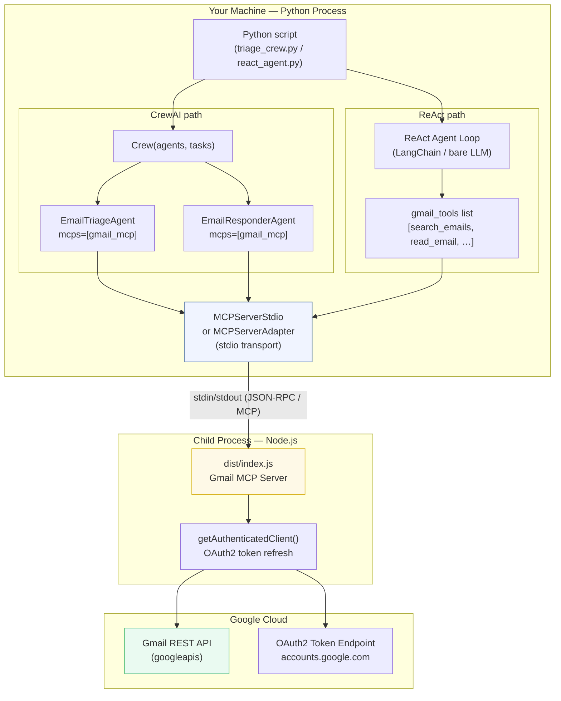
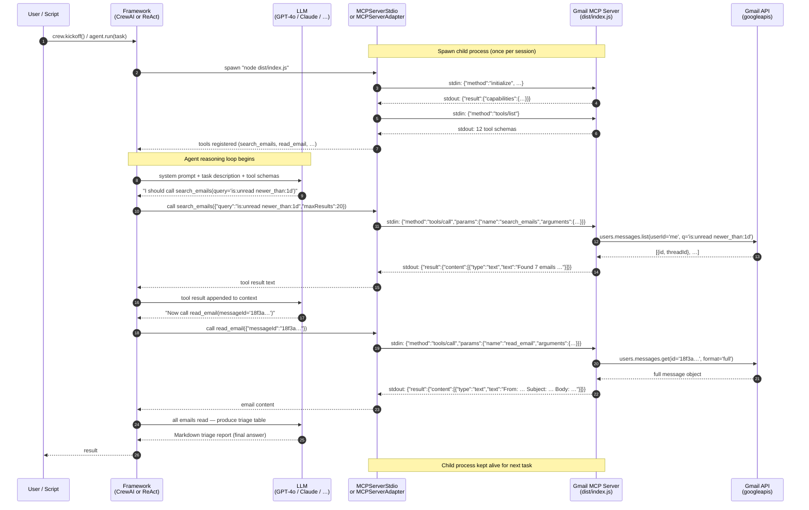
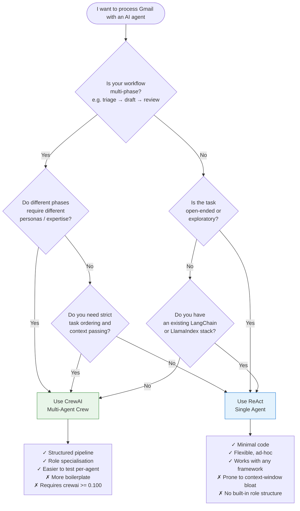

# CrewAI vs ReAct Agent — A Practical Guide for Gmail MCP

> This guide compares two mainstream approaches to building an AI agent that
> interacts with your Gmail inbox via MCP tools: a **multi-agent CrewAI crew**
> and a single **ReAct (Reasoning + Acting) agent**.  Both approaches use the
> same underlying Gmail MCP server — they differ in how they orchestrate the LLM
> and tools to accomplish a goal.

---

## Table of Contents

- [CrewAI vs ReAct Agent — A Practical Guide for Gmail MCP](#crewai-vs-react-agent--a-practical-guide-for-gmail-mcp)
  - [Table of Contents](#table-of-contents)
  - [1. What is the MCP Connection?](#1-what-is-the-mcp-connection)
    - [Connection steps (both frameworks)](#connection-steps-both-frameworks)
  - [2. Architecture Diagram](#2-architecture-diagram)
  - [3. Sequence Diagram — How a Tool Call Flows](#3-sequence-diagram--how-a-tool-call-flows)
  - [5. Technical Specification — MCP Connection](#5-technical-specification--mcp-connection)
    - [4.1 Transport layer](#41-transport-layer)
    - [4.2 Initialization handshake](#42-initialization-handshake)
    - [4.3 Tool discovery](#43-tool-discovery)
    - [4.4 Tool invocation](#44-tool-invocation)
    - [4.5 Response format](#45-response-format)
    - [4.6 Error handling](#46-error-handling)
    - [4.7 Process lifecycle](#47-process-lifecycle)
    - [4.8 Required environment variables](#48-required-environment-variables)
  - [5. CrewAI — Multi-Agent Orchestration](#5-crewai--multi-agent-orchestration)
    - [What it is](#what-it-is)
    - [How the MCP connection is configured](#how-the-mcp-connection-is-configured)
    - [Key characteristics](#key-characteristics)
  - [6. ReAct — Single Agent Loop](#6-react--single-agent-loop)
    - [What it is](#what-it-is-1)
    - [How the MCP connection is configured](#how-the-mcp-connection-is-configured-1)
    - [Key characteristics](#key-characteristics-1)
  - [7. Side-by-Side Code Comparison](#7-side-by-side-code-comparison)
  - [8. Decision Guide](#8-decision-guide)
    - [Quick-reference table](#quick-reference-table)
  - [9. Running Both Examples](#9-running-both-examples)
    - [Prerequisites](#prerequisites)
    - [Environment variables](#environment-variables)
    - [Run the CrewAI example](#run-the-crewai-example)
    - [Run a ReAct agent (inline example)](#run-a-react-agent-inline-example)
  - [Further Reading](#further-reading)

---

## 1. What is the MCP Connection?

**MCP (Model Context Protocol)** is an open standard that lets an AI agent call
external capabilities — called *tools* — through a well-typed interface.  The
Gmail MCP server in this repository exposes 12 tools (search_emails, read_email,
send_email, etc.) over **stdio transport**: the Python (or Node) client spawns
the server as a child process and communicates over standard input/output.

There is **no HTTP server, no network port, no REST API**. The conversation
between client and server uses the JSON-RPC-style MCP wire format written
directly to `stdin` / `stdout`.

### Connection steps (both frameworks)

1. The Python process spawns `node dist/index.js` with OAuth credentials in
   the environment.
2. MCP performs a capability handshake — the server returns its 12-tool schema.
3. When the LLM decides to call a tool, the framework serialises the call to
   JSON and writes it to the child process's `stdin`.
4. The child reads the JSON, executes the Gmail API call, and writes the result
   to `stdout`.
5. The framework reads `stdout`, deserialises the result, and feeds it back to
   the LLM as a tool observation.

---

## 2. Architecture Diagram



---

## 3. Sequence Diagram — How a Tool Call Flows

This diagram shows one full round-trip from `crew.kickoff()` (or the ReAct
loop) through the MCP server to the Gmail API and back.



---

## 5. Technical Specification — MCP Connection

This section documents the exact wire protocol, message format, and process
lifecycle for connecting any Python agent framework to the Gmail MCP server.

### 4.1 Transport layer

| Property | Value |
|---|---|
| **Transport** | stdio (standard input / output) |
| **Wire format** | JSON-RPC 2.0 framed by Content-Length headers (same as LSP) |
| **Direction** | Client writes to child's `stdin`; reads from child's `stdout` |
| **Encoding** | UTF-8, newline-terminated frames |
| **Concurrency** | Single-threaded request/response; no multiplexing |

Each message is sent as:

```
Content-Length: <byte-length>\r\n
\r\n
{"jsonrpc":"2.0", ...}
```

The MCP Python library (`mcp>=1.0`) and both `MCPServerStdio` / `MCPServerAdapter`
handle framing automatically — you never write raw bytes.

### 4.2 Initialization handshake

When the child process starts, the client must send an `initialize` request
before any other call. The server replies with its capabilities and the agreed
protocol version.

```jsonc
// Client → Server  (stdin)
{
  "jsonrpc": "2.0",
  "id": 1,
  "method": "initialize",
  "params": {
    "protocolVersion": "2024-11-05",
    "capabilities": {},
    "clientInfo": { "name": "crewai-mcp-client", "version": "1.0" }
  }
}

// Server → Client  (stdout)
{
  "jsonrpc": "2.0",
  "id": 1,
  "result": {
    "protocolVersion": "2024-11-05",
    "capabilities": { "tools": {} },
    "serverInfo": { "name": "Gmail MCP Server", "version": "1.0.0" }
  }
}
```

The client must then send an `initialized` notification (no `id`) to signal
it is ready:

```jsonc
{ "jsonrpc": "2.0", "method": "notifications/initialized" }
```

### 4.3 Tool discovery

After initialization, the client requests the full tool schema list:

```jsonc
// Client → Server
{ "jsonrpc": "2.0", "id": 2, "method": "tools/list", "params": {} }

// Server → Client  (abbreviated — 12 tools total)
{
  "jsonrpc": "2.0",
  "id": 2,
  "result": {
    "tools": [
      {
        "name": "search_emails",
        "description": "Search emails using Gmail query syntax",
        "inputSchema": {
          "type": "object",
          "properties": {
            "query":      { "type": "string",  "description": "Gmail search query" },
            "maxResults": { "type": "number",  "description": "Max results (default 10, max 50)" }
          },
          "required": ["query"]
        }
      },
      {
        "name": "read_email",
        "description": "Get the full content of a specific email",
        "inputSchema": {
          "type": "object",
          "properties": {
            "messageId": { "type": "string", "description": "Gmail message ID" }
          },
          "required": ["messageId"]
        }
      }
      // … 10 more tools (send_email, create_draft, reply_to_email,
      //    delete_email, mark_as_read, mark_as_unread, set_labels,
      //    list_emails, get_labels, get_profile)
    ]
  }
}
```

The framework converts each JSON Schema entry into a typed tool object that the
LLM sees in its system prompt.

### 4.4 Tool invocation

When the LLM picks a tool, the framework sends a `tools/call` request:

```jsonc
// Client → Server
{
  "jsonrpc": "2.0",
  "id": 7,
  "method": "tools/call",
  "params": {
    "name": "search_emails",
    "arguments": {
      "query": "is:unread newer_than:1d",
      "maxResults": 20
    }
  }
}
```

### 4.5 Response format

Every tool result is wrapped in a `content` array.  Each element has a `type`
(`"text"` for most Gmail tools) and the actual payload in `text`:

```jsonc
// Server → Client
{
  "jsonrpc": "2.0",
  "id": 7,
  "result": {
    "content": [
      {
        "type": "text",
        "text": "Found 7 emails:\n1. From: alice@example.com | Subject: Q2 review | ID: 18f3a4b…\n…"
      }
    ],
    "isError": false
  }
}
```

If `isError` is `true`, the `text` field contains the error message instead of
the result. The framework propagates this back to the LLM as an observation.

### 4.6 Error handling

| Scenario | Server behaviour | Client/framework behaviour |
|---|---|---|
| Missing required argument | `isError: true` with descriptive message | LLM retries with correct args |
| OAuth token expired | Server refreshes automatically via `getAuthenticatedClient()` | Transparent to the client |
| Gmail API 429 (rate limit) | `isError: true`, message: "Rate limit exceeded" | LLM should back off and retry |
| Gmail API 5xx | `isError: true`, HTTP status in message | Surface to user |
| Child process crash | `stdout` closes unexpectedly | MCPServerAdapter raises `RuntimeError`; MCPServerStdio re-raises in the agent loop |
| Invalid JSON frame | Server closes connection | Framework raises connection error |

### 4.7 Process lifecycle

```
Python starts              Child started           Child stopped
     │                          │                       │
     ▼                          ▼                       ▼
 [spawn node]─────────────►[initialize]──── … ────►[process.exit()]
                                │                       ▲
                           [tools/list]                 │
                                │               Context manager __exit__
                           [tools/call ×N]      or Crew teardown
```

- **`MCPServerStdio`** (CrewAI DSL): process starts on first agent tool call;
  stays alive until the `Crew` object is garbage-collected.
- **`MCPServerAdapter`** (context manager): process starts on `__enter__`,
  stops on `__exit__` — use the `with` block to bound the lifetime.
- Both send a SIGTERM (or `ChildProcess.kill()` on Windows) to the Node process
  on shutdown — the server flushes any pending replies before exiting.

### 4.8 Required environment variables

The Node child process reads credentials from its own environment.  You must
forward them explicitly — they are **not** inherited automatically by
`MCPServerStdio`.

| Variable | Required | Description |
|---|---|---|
| `GMAIL_CLIENT_ID` | Yes | Google OAuth 2.0 Client ID |
| `GMAIL_CLIENT_SECRET` | Yes | Google OAuth 2.0 Client Secret |
| `GMAIL_REFRESH_TOKEN` | Yes* | Refresh token from the setup wizard |
| `CREDENTIALS_PATH` | No | Path to `token.json` (default: `credentials/token.json`) |

\* If absent, the server falls back to reading `credentials/token.json`.

**Python snippet — forwarding credentials safely:**

```python
import os
from crewai.mcp import MCPServerStdio

# Read from the current process environment — never hardcode values
gmail_mcp = MCPServerStdio(
    command="node",
    args=["dist/index.js"],
    env={
        # Required: OAuth credentials
        "GMAIL_CLIENT_ID":     os.environ["GMAIL_CLIENT_ID"],
        "GMAIL_CLIENT_SECRET": os.environ["GMAIL_CLIENT_SECRET"],
        "GMAIL_REFRESH_TOKEN": os.environ["GMAIL_REFRESH_TOKEN"],
        # Recommended: preserve PATH so Node can resolve its own modules
        "PATH":                os.environ.get("PATH", ""),
        # Optional: silence Node.js deprecation warnings
        "NODE_NO_WARNINGS":    "1",
    },
    cache_tools_list=True,
)
```

> **Security note**: never pass `**os.environ` wholesale to the child process;
> it would forward all secrets (API keys, tokens, etc.) present in the parent.
> Pass only the variables the server actually needs.

---

## 5. CrewAI — Multi-Agent Orchestration

### What it is

CrewAI models your workflow as a **crew** of specialised agents that each own
a role, a goal, and a backstory. Tasks are handed between agents in a defined
`Process` (sequential, parallel, or hierarchical). Each agent gets the full
MCP tool list but focuses on its narrow responsibility.

### How the MCP connection is configured

```python
from crewai.mcp import MCPServerStdio

gmail_mcp = MCPServerStdio(
    command="node",
    args=["dist/index.js"],
    env={
        "GMAIL_CLIENT_ID":     os.environ["GMAIL_CLIENT_ID"],
        "GMAIL_CLIENT_SECRET": os.environ["GMAIL_CLIENT_SECRET"],
        "GMAIL_REFRESH_TOKEN": os.environ["GMAIL_REFRESH_TOKEN"],
    },
    cache_tools_list=True,   # list tools once; reuse schema for every agent
)

agent = Agent(
    role="Email Triage Specialist",
    goal="Categorise every unread email by priority.",
    backstory="...",
    mcps=[gmail_mcp],        # ← MCP server attached here
)
```

- `MCPServerStdio` spawns `node dist/index.js` as a child process when the
  agent first needs a tool.
- `cache_tools_list=True` avoids a `tools/list` call on every task, improving
  performance when multiple agents share the same server.
- The server is kept alive for the life of the `Crew` and torn down when it
  exits.

### Key characteristics

| Property | Detail |
|---|---|
| **Agents** | Multiple, each with a distinct *role / goal / backstory* |
| **Task flow** | Sequential (or parallel / hierarchical via `Process`) |
| **Context passing** | `context=[prior_task]` lets downstream agents see upstream output |
| **Tool sharing** | All agents can see all 12 Gmail tools |
| **Best for** | Pipelines with distinct phases (triage → draft → review → send) |

---

## 6. ReAct — Single Agent Loop

### What it is

**ReAct** (*Reasoning + Acting*) is a prompting pattern where a single LLM
iterates in a `Thought → Action → Observation` loop until it reaches a final
answer.  There is no crew, no role assignment, and no structured task handoff —
the LLM decides *everything* in one context window.

You can run a ReAct agent using:
- **LangChain** `create_react_agent` / `AgentExecutor`
- **LlamaIndex** `ReActAgent`
- **Bare MCP** with a custom loop
- **Smolagents** `ToolCallingAgent`

The example below uses `MCPServerAdapter` (which works with any Python
framework) to get the 12 Gmail tools as a plain Python list, then hands them
to LangChain's ReAct executor.

### How the MCP connection is configured

```python
from crewai_tools import MCPServerAdapter   # also works standalone, no CrewAI needed
from mcp import StdioServerParameters

server_params = StdioServerParameters(
    command="node",
    args=["dist/index.js"],
    env={
        "GMAIL_CLIENT_ID":     os.environ["GMAIL_CLIENT_ID"],
        "GMAIL_CLIENT_SECRET": os.environ["GMAIL_CLIENT_SECRET"],
        "GMAIL_REFRESH_TOKEN": os.environ["GMAIL_REFRESH_TOKEN"],
        **os.environ,   # preserve PATH so subprocess can find node
    },
)

with MCPServerAdapter(server_params, connect_timeout=60) as gmail_tools:
    # gmail_tools is a plain list of BaseTool-compatible objects
    agent = create_react_agent(llm, gmail_tools, prompt)
    executor = AgentExecutor(agent=agent, tools=gmail_tools, verbose=True)
    result = executor.invoke({"input": task_description})
```

- The child process is alive only inside the `with` block.
- `gmail_tools` is a standard Python list — compatible with LangChain, but also
  passable to any framework that accepts `BaseTool`.

### Key characteristics

| Property | Detail |
|---|---|
| **Agents** | One — the LLM drives everything |
| **Task flow** | Free-form `Thought → Action → Observation` loop |
| **Context** | Everything is in one growing context window |
| **Tool sharing** | N/A — the single agent owns all tools |
| **Best for** | Ad-hoc tasks, exploration, simple one-shot goals |

---

## 7. Side-by-Side Code Comparison

```python
# ── CREWAI (multi-agent) ─────────────────────────────────────────────────────
from crewai import Agent, Crew, Process, Task
from crewai.mcp import MCPServerStdio

gmail_mcp = MCPServerStdio(command="node", args=["dist/index.js"], env=CREDS)

triage_agent = Agent(
    role="Email Triage Specialist",
    goal="Categorise every unread email.",
    backstory="Meticulous executive assistant.",
    mcps=[gmail_mcp],
)

responder_agent = Agent(
    role="Professional Email Writer",
    goal="Draft replies for Action Required emails.",
    backstory="Writes clear, polite business emails.",
    mcps=[gmail_mcp],
)

triage_task = Task(
    description="Search, read, and categorise unread emails from the last 24h.",
    expected_output="Markdown triage table.",
    agent=triage_agent,
)
reply_task = Task(
    description="For each Action Required email, call create_draft.",
    expected_output="List of draft confirmations.",
    agent=responder_agent,
    context=[triage_task],       # ← receives triage output
)

crew = Crew(
    agents=[triage_agent, responder_agent],
    tasks=[triage_task, reply_task],
    process=Process.sequential,
)
result = crew.kickoff()
```

```python
# ── REACT (single agent, LangChain) ──────────────────────────────────────────
from crewai_tools import MCPServerAdapter
from mcp import StdioServerParameters
from langchain.agents import AgentExecutor, create_react_agent
from langchain_openai import ChatOpenAI

server_params = StdioServerParameters(
    command="node", args=["dist/index.js"], env={**CREDS, **os.environ}
)

with MCPServerAdapter(server_params, connect_timeout=60) as gmail_tools:
    llm = ChatOpenAI(model="gpt-4o")
    prompt = hub.pull("hwchase17/react")   # standard ReAct prompt template

    agent = create_react_agent(llm, gmail_tools, prompt)
    executor = AgentExecutor(agent=agent, tools=gmail_tools, verbose=True)

    result = executor.invoke({
        "input": (
            "Search for unread emails from the last 24 hours, "
            "categorise them by priority, and create a draft reply "
            "for anything that needs a response today."
        )
    })

print(result["output"])
```

---

## 8. Decision Guide



### Quick-reference table

| Criteria | CrewAI | ReAct (single agent) |
|---|---|---|
| **Number of agents** | Multiple (1 per role) | One |
| **Task structure** | Declarative `Task` objects | Implicit (inside the LLM's reasoning) |
| **Context passing** | `context=[task]` — explicit | Accumulates in the context window |
| **Context window growth** | Bounded per agent | Unbounded — can hit limits on long tasks |
| **Role specialisation** | First-class (`role`, `goal`, `backstory`) | Prompt-engineered system message only |
| **MCP integration** | `mcps=[server]` DSL or `MCPServerAdapter` | `MCPServerAdapter` → `tools=` list |
| **Parallel tasks** | `Process.parallel` built-in | Manual (asyncio / threading) |
| **Debugging** | Per-agent verbose logs, task outputs | Single verbose trace |
| **Framework lock-in** | CrewAI | Any framework that accepts `BaseTool` |
| **Code amount** | ~50–80 lines of structured setup | ~20–30 lines |

---

## 9. Running Both Examples

### Prerequisites

```bash
# Build the Gmail MCP server (do this once)
npm install
npm run build

# Install Python dependencies
pip install "crewai>=0.100" "crewai-tools[mcp]>=0.14" mcp langchain langchain-openai
```

### Environment variables

```bash
export GMAIL_CLIENT_ID="your-client-id"
export GMAIL_CLIENT_SECRET="your-client-secret"
export GMAIL_REFRESH_TOKEN="your-refresh-token"
export OPENAI_API_KEY="your-openai-key"
```

### Run the CrewAI example

```bash
python examples/crewai_email_triage/triage_crew.py
```

### Run a ReAct agent (inline example)

```python
# react_email_agent.py
import os
from pathlib import Path
from crewai_tools import MCPServerAdapter
from mcp import StdioServerParameters
from langchain import hub
from langchain.agents import AgentExecutor, create_react_agent
from langchain_openai import ChatOpenAI

REPO_ROOT = Path(__file__).resolve().parent
MCP_PATH   = REPO_ROOT / "dist" / "index.js"

CREDS = {
    "GMAIL_CLIENT_ID":     os.environ["GMAIL_CLIENT_ID"],
    "GMAIL_CLIENT_SECRET": os.environ["GMAIL_CLIENT_SECRET"],
    "GMAIL_REFRESH_TOKEN": os.environ["GMAIL_REFRESH_TOKEN"],
}

server_params = StdioServerParameters(
    command="node",
    args=[str(MCP_PATH)],
    env={**CREDS, **os.environ},
)

TASK = (
    "Search for unread emails from the last 24 hours (is:unread newer_than:1d). "
    "Read the top 5, categorise each as Urgent / Action Required / FYI / Newsletter, "
    "and for any Action Required email create a draft reply. "
    "Return a Markdown summary. Do NOT call send_email."
)

with MCPServerAdapter(server_params, connect_timeout=60) as gmail_tools:
    llm   = ChatOpenAI(model="gpt-4o", temperature=0)
    prompt = hub.pull("hwchase17/react")
    agent  = create_react_agent(llm, gmail_tools, prompt)

    executor = AgentExecutor(
        agent=agent,
        tools=gmail_tools,
        verbose=True,
        max_iterations=20,   # guard against infinite loops
        handle_parsing_errors=True,
    )

    result = executor.invoke({"input": TASK})
    print(result["output"])
```

```bash
python react_email_agent.py
```

---

## Further Reading

- [USAGE.md](USAGE.md) — full Gmail MCP server setup guide and tool reference
- [CrewAI docs — MCP integration](https://docs.crewai.com/en/mcp/overview)
- [MCP specification](https://spec.modelcontextprotocol.io)
- [LangChain ReAct agent](https://python.langchain.com/docs/modules/agents/agent_types/react)
- [MCPServerAdapter source](https://github.com/crewAIInc/crewAI-tools/tree/main/crewai_tools/tools/mcp)
